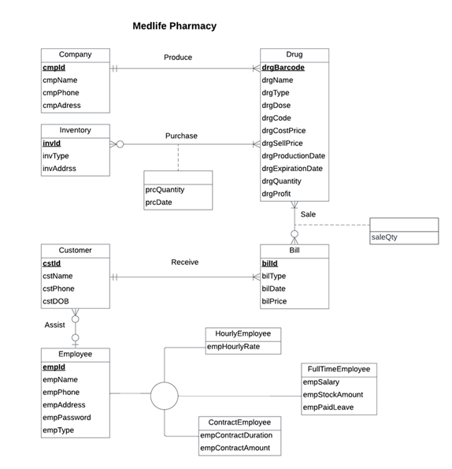

# Medlife Pharmacy DBMS

[](https://www.gnu.org/licenses/gpl-3.0)

## Overview

Medlife Pharmacy is a Database Management System (DBMS) designed to streamline operations for a pharmaceutical store. Developed as a group project for **BUDT 703: Database Management Systems** (Fall 2022, taught by Professor Adam Lee) at the **Robert H. Smith School of Business, University of Maryland, College Park**, this system manages medication-related data to ensure safety, accuracy, and efficiency. It handles inventory, drug details, customer information, employee records, and sales transactions, enabling pharmacies to manage large datasets effectively and maintain a competitive edge.

**Primary Objectives**:
- Develop a system to meet the day-to-day requirements of a pharmacy.
- Ensure safety, accuracy, and efficiency in pharmaceutical operations.
- Provide detailed drug information for easy location in the store.
- Streamline inventory management.
- Offer a competitive advantage through optimized data management.

## Features

- **Data Management**: Stores and manages data for companies, drugs, inventory, employees, customers, bills, purchases, and sales.
- **Entity Relationships**: Implements a relational database with relationships like Produce, Purchase, Sale, Receive, and Assists.
- **Business Queries**: Supports analytical queries for customer assistance, inventory management, sales trends, and profitability analysis.
- **Scalable Design**: Includes employee subtypes (Hourly, Full-Time, Contract) to accommodate various employment models.

## Database Design

### Entity Relationship Diagram (ERD)


The ERD illustrates relationships between entities: Company, Drug, Inventory, Employee, Customer, Bill, Purchase, and Sale. Key relationships include:
- **Produce**: One Company produces one or more Drugs; one Drug is produced by one Company.
- **Purchase**: One Inventory contains one or more Drugs; one Drug can be in multiple Inventories.
- **Sale**: One Bill includes one or more Drugs; one Drug can appear in multiple Bills.
- **Receive**: One Customer receives one or more Bills; one Bill is received by one Customer.
- **Assists**: One Employee assists zero or more Customers; one Customer is assisted by zero or one Employee.

### Tables
- **Company**: `cmpName` (PK), `cmpPhone`, `cmpAddress`
- **Drug**: `drgBarcode` (PK), `drgName`, `drgType`, `drgDose`, `drgCode`, `drgCostPrice`, `drgSellPrice`, `drgProductionDate`, `drgExpirationDate`, `drgQuantity`, `drgProfit`, `cmpName` (FK)
- **Inventory**: `invId` (PK), `invType`, `invAddress`
- **Employee**: `empId` (PK), `empName`, `empPhone`, `empAddress`, `empPassword`, `empType`
- **HourlyEmployee**: `empId` (PK, FK), `empHourlyRate`
- **FullTimeEmployee**: `empId` (PK, FK), `empSalary`, `empStockAmount`, `empPaidLeave`
- **ContractEmployee**: `empId` (PK, FK), `empContractDurationMonths`, `empContractAmount`
- **Customer**: `cstId` (PK), `cstName`, `cstPhone`, `cstDOB`, `empId` (FK)
- **Bill**: `bilId` (PK), `bilType`, `bilPrice`, `bilDate`, `cstId` (FK)
- **Purchase**: `invId` (PK, FK), `drgBarcode` (PK, FK), `prcQuantity`, `prcDate`
- **Sale**: `drgBarcode` (PK, FK), `bilId` (PK, FK), `saleQty`

### Business Rules
- **R1**: Company data persists even if the company shuts down.
- **R3**: Drug data persists even if the company stops producing it.
- **R5, R7**: Inventory data is set to NULL when a drug is no longer purchased.
- **R11**: Deleting a bill removes associated sale information.
- **R13, R15**: Employee and customer data are independent of each other’s deletion.

## Setup Instructions

### Prerequisites
- A relational DBMS (e.g., MySQL, PostgreSQL).
- SQL client (e.g., MySQL Workbench, DBeaver).

### Installation
1. **Clone the Repository**:
   ```bash
   git clone https://github.com/yash-makadia/Medlife-Pharmacy-DBMS.git
   cd Medlife-Pharmacy-DBMS
   ```
2. **Create the Database**:
   - Create a database: `CREATE DATABASE medlife_pharmacy;`
   - Use the database: `USE medlife_pharmacy;`
3. **Run SQL Scripts**:
   - Execute `schema.sql` to create tables and insert sample data.
   - Execute `queries.sql` to run analytical queries.
4. **Verify Data**:
   - Check table contents: `SELECT * FROM <table_name>;`
   - Review query outputs in `media/query_outputs/`.

## Usage

### Running Business Queries
The `queries.sql` file contains four analytical queries:
1. **Customer Assistance Analysis**: Identifies whether full-time or hourly employees assist more customers.
2. **Inventory Management**: Retrieves drug purchase quantities for a specific month and year.
3. **Sales Trends**: Analyzes the most-sold drugs by year.
4. **Profitability Analysis**: Calculates the most profitable drugs based on sales volume and profit margins.

Run these queries using your SQL client after setting up the database.

### Sample Data
Sample data in `schema.sql` includes:
- **Companies**: Pfizer Inc, AbbVie Inc, Johnson & Johnson, Roche, Merck, Sanofi, AstraZeneca, Novartis.
- **Drugs**: Atorvastatin, Levothyroxine, Metformin, Alecensa, Esbriet, Adakveo, Arzerra, Clarinex, Fosamax, Adacel, Admelog, Lokelma, Nexium.
- **Inventory**: Warehouses at various addresses.
- **Customers**: Sample customers with purchase histories.

## Project Files

- `schema.sql`: SQL script for table creation and sample data insertion.
- `queries.sql`: SQL script for business transaction queries.
- `docs/Project_Proposal.pdf`: Project proposal document.
- `docs/Project_Readme.pdf`: Original README document.
- `docs/Project_Presentation.pdf`: Project presentation slides.
- `media/erd.png`: Entity Relationship Diagram.
- `media/query_outputs/`: Screenshots of query outputs.

## Course Information

- **Course**: BUDT 703: Database Management Systems
- **Professor**: Adam Lee
- **Semester**: Fall 2022
- **Institution**: Robert H. Smith School of Business, University of Maryland, College Park

## References

- [G2 Pharmacy Management Systems](https://www.g2.com/categories/pharmacy-management-systems)
- [Wikipedia: Pharmacy Management System](https://en.wikipedia.org/wiki/Pharmacy_management_system)
- [ARIRMS: Features of Pharmacy Management System](https://arirms.com/features-of-pharmacy-management-system)

## License

This project is licensed under the GNU General Public License v3.0 - see the [LICENSE](LICENSE) file for details.

## Contributing

Contributions are welcome! Please fork the repository, create a new branch, and submit a pull request with your changes. Ensure that any contributions comply with the GPL-3.0 license.

## Contact

For questions or feedback, please open an issue on GitHub or contact me at yashmakadia1908@gmail.com.
